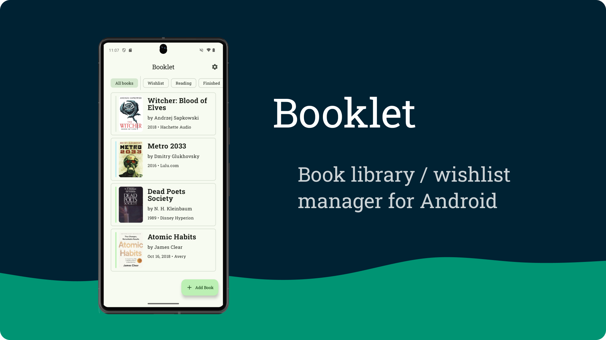
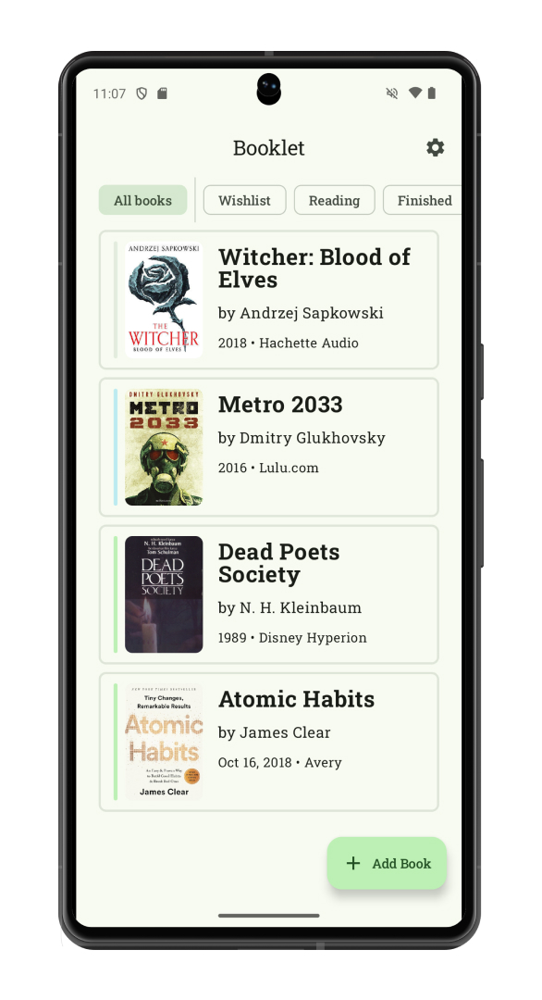
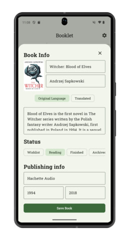
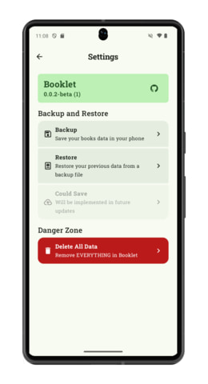

# Booklet - Manage Your Library
Booklet is an android library manager for your books. You can easily add and manager your books, with ability to make a backup of your data anytime.

You can checkout [latest release](https://github.com/alibardide-dev/News-app/releases/latest) of Booklet

# Screenshots
<div style="width:100%; display:flex; justify-content:space-between;">

[](docs/screenshot_1.jpg)
[](docs/screenshot_1.jpg)
[](docs/screenshot_1.jpg)
[](docs/screenshot_1.jpg)

</div>

# Features
- [X] Add Books
- [X] Filter books
- [X] Set covers
- [X] Backup data + covers
- [X] Import data and convers from file
- [X] Selection / Bulk delete
- [ ] Categories
- [ ] Custom Lists
- [ ] Cloud Backup
- [ ] Search
- [ ] Grid View
- [ ] Check for Updates
- [ ] Smoother scroll (Pagination)
- [ ] Rating
- [ ] Optional Fields
- [ ] More Ideas

# Repo Structure
```
├── app/src/main/
│   ├── java/com/phoenix/booklet/
│   │   ├── data/ # Handle data related tasks (Network, Local) 
│   │   ├── screen/ # Directory which stores application screens
│   │   │   ├── home/
│   │   │   ├── settings/
│   │   │   ├── AppNavigation.kt
│   │   ├── ui/theme/
│   │   ├── utils/
│   │   │   ├  DatabaseConstants.kt
│   │   │   ├  DatabaseModule.kt
│   │   │   ├  DateUtils.kt
│   │   │   ├  FileUtils.kt
│   │   ├   BaseApplication
│   │   ├   MainActivity.kt
│   ├── res/ # Resources
│   │   ├── drawable/
│   │   ├── mipmap/
│   │   ├── ...
│   ├   AndroidManifest.xml/
├── gradle/
│   └── ...
├── LISENCE
└── README.md
```

# Tech Stack
- Kotlin for programming android application
- Jetpack compose to design declaritive android ui
- Room for SQLite database
- Coil to load network from url

# Setup

- Clone reposity by running git clone `https://github.com/alibardide-dev/Booklet`
- Install Android Studio and Android SDK
- Build project with Ctrl + F9
- Install Virtual Machine or connect a Physical Device
- Run using Shift + F10

# Support
If you like this application, just support it by joining [stargazers](https://github.com/alibardide-dev/Booklet/stargazers) for this repository \
And [follow me](https://github.com/alibardide-dev?tab=followers) for my next creations

# License
Booklet by [Ali Bardide](https://github.com/alibardide-dev) is licensed under a [Apache License 2.0](http://www.apache.org/licenses/LICENSE-2.0).
